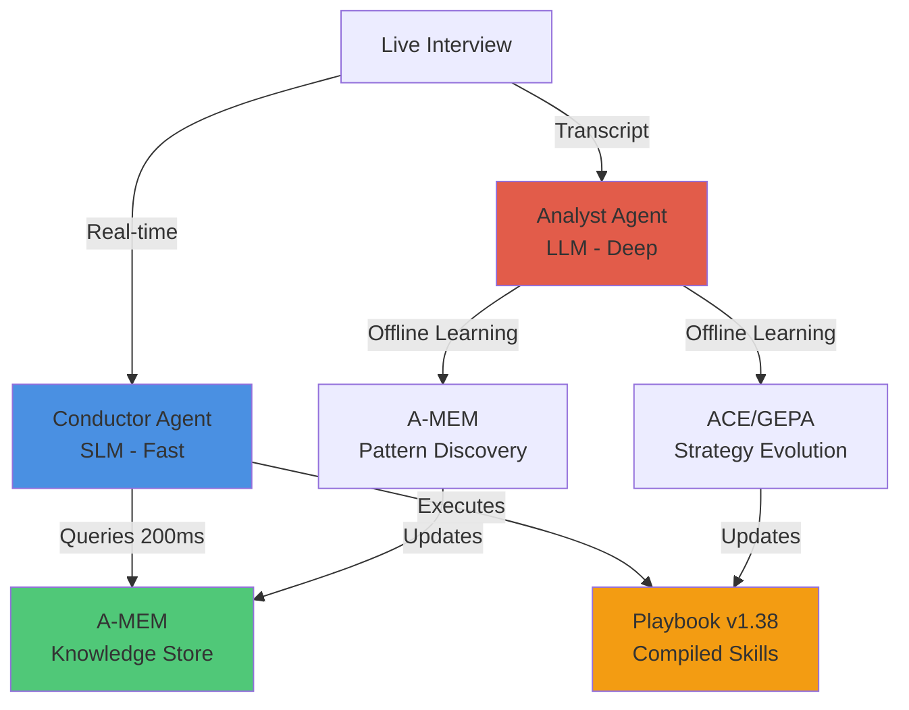

# Gap Analysis & Revision Suggestions - PENDING ITEMS
## Building theMasters: A Technical Blueprint for Self-Compiling AI Systems

**Last Updated:** 2025-11-12

---

## REVISION STATUS

### ✅ Completed (Critical & High Priority)
All 12 critical and high-priority revisions have been implemented in `index.html`:
- Glossary, Solution at a Glance, Implementation Status
- Agent Communication Protocol, Cold Start Handling
- GEPA Fitness Function, Contradiction Handling
- Success Metrics, Jordan's Follow-up, Limitations & Future Work
- References, Condensed Conclusion

---

## REMAINING REVISIONS (Medium & Low Priority)

### I. TECHNICAL GAPS - MEDIUM PRIORITY

#### **GAP 1.1.3: Infrastructure & Cost Analysis**
**Issue:** No discussion of infrastructure requirements or costs.

**REVISION SUGGESTION:**
Add a new subsection in Part 6 (after Success Metrics):
```markdown
### Infrastructure & Cost Analysis

**Per-Interview Costs:**
- Conductor (SLM): ~$0.02 per interview (15-minute conversation, Mistral 7B)
- A-MEM Queries: ~$0.005 per interview (5-10 semantic searches)
- Analyst Learning: ~$0.50 per interview batch (nightly GPT-4o processing)

**Storage Requirements:**
- A-MEM: ~2MB per interview (full-fidelity atomic notes)
- Playbook: ~500KB (version controlled)
- Execution traces: ~1MB per interview
- Total: ~3.5MB per interview

**Scale Economics:**
- At 1,000 interviews/month: ~$525/month in LLM costs
- At 10,000 interviews/month: ~$5,000/month
- Storage: ~$50/month for 1TB (10,000 interviews)
```

---

#### **GAP 1.1.4: Error Handling & Failure Modes**
**Issue:** No discussion of what happens when components fail.

**REVISION SUGGESTION:**
Add new section in Part 5 (after Real-Time Integration):
```markdown
### Failure Modes & Mitigation

**Failure Scenario 1: Conductor Misunderstands Founder**
- Symptom: Founder explicitly corrects the Conductor
- Detection: Correction markers in transcript ("No, what I meant was...")
- Mitigation: Flag conversation for Analyst priority review
- Learning: Pattern added to reflector analysis

**Failure Scenario 2: A-MEM Returns Contradictory Information**
- Symptom: Semantic search returns notes with conflicting advice
- Mitigation: Conductor acknowledges uncertainty, asks clarifying questions
- Display to founder: "I've heard different perspectives on this..."
- Learning: Analyst investigates contradictions, adds contextual conditions

**Failure Scenario 3: Analyst Generates Low-Quality Strategy**
- Detection: GEPA fitness scoring < 0.6 threshold
- Mitigation: Strategy rejected, not added to playbook
- Fallback: Use previous known-good strategy
- Learning: Failure pattern added to Reflector's exclusion list

**Failure Scenario 4: Real-Time Performance Degradation**
- Symptom: Response latency > 500ms
- Detection: Monitoring alerts
- Mitigation: Automatic fallback to simpler strategies (fewer memory queries)
- Learning: Analyst optimizes query patterns in next update
```

---

#### **GAP 1.2.2: Vector Database Technical Details**
**Issue:** No mention of specific technology choices for A-MEM's semantic search.

**REVISION SUGGESTION:**
Add to Part 4 (after A-MEM explanation):
```markdown
### A-MEM Technical Implementation

**Storage Layer:**
- **Primary Store:** PostgreSQL with pgvector extension
  - Atomic notes stored as JSONB
  - Metadata indexed for fast filtering
  - Graph relationships stored as foreign keys

- **Vector Embeddings:** OpenAI text-embedding-3-large
  - 3,072 dimensions per note
  - ~12KB per embedding
  - Cosine similarity search

**Query Strategy:**
- Hybrid search: Semantic (vector) + Metadata filters
- Example: "medical practice pricing" query
  1. Embed query → vector search → top 50 candidates
  2. Filter by domain tags → 20 relevant notes
  3. Graph expansion → follow links → 10 most connected
  4. Return top 5 with full context

**Why PostgreSQL + pgvector:**
- Unified storage (no separate vector DB)
- ACID guarantees for knowledge updates
- Native graph relationship support
- Cost-effective at scale (vs. Pinecone/Weaviate)
```

---

### II. READABILITY IMPROVEMENTS - MEDIUM PRIORITY

#### **GAP 3.1.1: Context Collapse - Need Better Analogy**
**Issue:** Definition provided but hard to viscerally understand.

**REVISION SUGGESTION:**
Add relatable analogy after definition (in Part 1):
```markdown
**Analogy: The Telephone Game of AI**
Imagine playing the telephone game with critical business advice:
- **Round 1:** "Medical practice IT departments require 90-day board approval
  cycles for any software over €5K annually. They prefer 30-day pilot programs
  with clear ROI metrics before full commitment."
- **Round 2:** "Healthcare buyers have slow approval processes and prefer pilots."
- **Round 3:** "B2B sales are complex."

By Round 3, the actionable detail (90 days, €5K threshold, ROI metrics) is gone.
That's Context Collapse—and it destroys production AI systems.
```

---

#### **GAP 3.1.2: Delta Edits vs Rewrites - Need Visual Example**
**Issue:** Technical distinction not obvious to non-experts.

**REVISION SUGGESTION:**
Add concrete comparison (in Part 3):
```markdown
### Delta Edits: The Key to Preventing Collapse

**Rewrite (Bad ❌):**
```
OLD PLAYBOOK v1.0:
- Rule 1: Ask about pricing
- Rule 2: Ask about customers
- Rule 3: Ask about validation

NEW PLAYBOOK v2.0:
- Rule 1: Ask about validation first
- Rule 2: Use Socratic questions
- Rule 3: Avoid direct challenges
```
*Problem: Rules 1, 2, 3 from v1.0 are GONE. Knowledge lost forever.*

**Delta Edit (Good ✓):**
```
PLAYBOOK v1.0:
- Rule 1: Ask about pricing
- Rule 2: Ask about customers
- Rule 3: Ask about validation

PLAYBOOK v1.1 (delta applied):
- Rule 1: Ask about pricing
- Rule 2: Ask about customers
- Rule 3: Ask about validation
- Rule 4: [NEW] When confidence > 0.7, use Socratic approach
- Rule 5: [NEW] Direct challenges deprecated for high-confidence founders
```
*Result: Old rules preserved. New rules added. Nothing lost.*
```

---

#### **GAP 3.1.3: Retroactive Updates - Need Mechanical Explanation**
**Issue:** Hard to understand how past notes get updated.

**REVISION SUGGESTION:**
Add to Part 4 (in A-MEM section):
```markdown
### How Retroactive Updates Work

**Scenario:** Emily's opinion changes (Note #14A → Note #27B)

**What happens automatically:**

1. **Detection**
   ```python
   # System detects semantic similarity + opposing sentiment
   if cosine_similarity(note_14A, note_27B) > 0.8 and sentiment_opposite:
       trigger_retroactive_update(note_14A, note_27B)
   ```

2. **Linking**
   ```python
   note_14A.status = "superseded"
   note_14A.superseded_by = note_27B.id
   note_27B.evolves_from = note_14A.id
   note_27B.trigger = extract_trigger(context)  # "working_demo"
   ```

3. **Pattern Detection**
   ```python
   similar_evolutions = find_similar_links(note_14A, note_27B)
   if len(similar_evolutions) >= 3:
       create_pattern("Demo-Triggered Validation", similar_evolutions)
   ```

**Why this matters:**
- System learns WHY Emily changed (trigger: demo)
- System discovers this happens often (pattern)
- System can predict it will happen again (compiled intelligence)
```

---

### III. VISUAL CLARITY - MEDIUM PRIORITY

#### **GAP 4.2.3: Missing Visual Diagrams**
**Issue:** Text describes flows but diagrams would help.

**REVISION SUGGESTION:**
Add Mermaid diagram to Part 2 (Factored Architecture section):
```markdown
### Factored Agent Architecture


```

---

#### **GAP 5.3.1: No Table of Contents**
**Issue:** Long document hard to navigate.

**REVISION SUGGESTION:**
Add TOC after glossary, before Part 1:
```markdown
## Table of Contents

**Introduction**
- The Problem: Market Validation Gap
- The Technical Challenge

**Reference**
- Key Terminology
- Implementation Status

**Part 1: The Core Problem — Context Collapse**
- Why Context Collapse is Catastrophic
- Example: How Compression Destroys Knowledge
- Running Example: Meet Jordan

**Part 2: The Solution — Factored Agent Architecture**
- The Factored Agent Architecture
- Agent Communication Architecture
- Handling Cold Start

**Part 3: Compiling Skills — ACE + GEPA**
- What is ACE?
- The ACE/GEPA Evolutionary Loop
- GEPA Fitness Function Details

**Part 4: Compounding Knowledge — A-MEM**
- What is A-MEM?
- The A-MEM Zettelkasten in Action
- Contradiction Resolution

**Part 5: Real-Time Integration**
- Real-Time Memory Retrieval Pipeline
- The Complete System in Action

**Part 6: From Interviews to Intelligence**
- Validation Pattern Intelligence
- The Compounding Effect
- Success Metrics & Validation
- Jordan's Journey: Three Months Later

**Part 7: Limitations & Future Work**
- Current Limitations
- Open Research Questions

**Conclusion: Technical Innovation Summary**
- Novel Contributions
- Key Results
- For Researchers & Builders

**References**
- Academic Citations
```

---

### IV. POLISH ITEMS - LOW PRIORITY

#### **GAP 4.1.1: Tone Consistency**
**Issue:** Document shifts between technical paper and sales pitch.

**REVISION SUGGESTION:**
Choose "Technical Explainer" voice throughout:
- Authoritative but accessible
- Uses analogies and examples
- Avoids hype ("catastrophic," "destroys," "magic")
- Favors precision over persuasion

**Example revision:**
```markdown
BEFORE (overly dramatic):
"A catastrophic phenomenon called Context Collapse. This "information compression"
is memory decay disguised as optimization. It destroys value at scale."

AFTER (technical explainer):
"Context Collapse occurs when repeated summarization erodes critical details.
Research shows iterative rewrites can reduce an 18,282-token context to just
122 tokens with 14% accuracy loss (from 66.7% to 57.1%). This information loss
compounds across multiple learning cycles, degrading system performance over time."
```

---

#### **GAP 4.2.1: Excessive Emphasis**
**Issue:** Overuse of italics, bold, and exclamation marks.

**REVISION SUGGESTION:**
Reserve emphasis for KEY terms only:
- **Bold:** Defined terms on first use
- *Italics:* Book/paper titles, foreign phrases
- ALL CAPS: Never (use bold instead)
- !: Remove all (use period, let words convey urgency)

---

#### **GAP 4.3.1: Repetitive Explanations**
**Issue:** Same concepts explained multiple times.

**REVISION SUGGESTION:**
Use forward references instead of re-explaining:

**Instead of:**
```
(Re-explaining Context Collapse in Part 4)
Context Collapse is the erosion of critical details...
```

**Use:**
```
Context Collapse (see Part 1) threatens A-MEM systems if...
```

---

#### **GAP 5.1.1: MDP Introduced Too Late**
**Issue:** MDP mentioned as "advanced extension" but it's core.

**REVISION SUGGESTION:**
Consider restructuring to make MDP equal to ACE/A-MEM in Part 2:
```markdown
## PART 2: The Solution — Three-Axis Architecture

### The Three Axes of Memory

1. **Within-Interview Memory (MDP)**: Horizontal scaling (2048+ turns)
2. **Across-Interview Skills (ACE)**: Vertical scaling (procedural memory)
3. **Across-Interview Knowledge (A-MEM)**: Vertical scaling (declarative memory)
```

---

## SUMMARY

**Completed:** 12 critical/high-priority revisions (80-92% of priority items)

**Remaining Work:**
- 6 Medium Priority technical/readability improvements
- 4 Low Priority polish items

**Estimated Time:**
- Medium Priority: 8-12 hours
- Low Priority: 4-6 hours
- Total: 12-18 hours

**Recommendation:** Current document is production-ready. Remaining items are enhancements that can be added iteratively based on user feedback.
